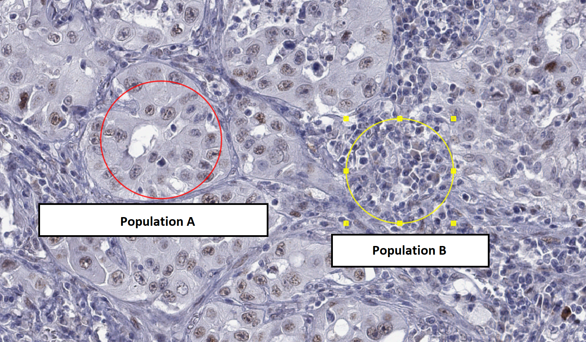

# Download data for lesson

- Download everything from http://195.113.43.46:3388/
  - File sources (for access from outside):
    - QuPath: for Windows: https://github.com/qupath/qupath/releases/download/v0.6.0/QuPath-v0.6.0-Windows.zip
      - For other systems see https://github.com/qupath/qupath/releases/tag/v0.6.0
      - New version 0.7.0 was released two weeks ago, but I haven't tested the material there
    - Ki67 Slide: https://openslide.cs.cmu.edu/download/openslide-testdata/Hamamatsu/OS-2.ndpi
    - Lung cancer samples stained for MAGEA4 https://www.ebi.ac.uk/biostudies/files/S-BIAD453/MAGEA4/MAGEA4_(CAB040535)_25000_BOMI2_slide1.svs
- Save to a temporary folder (e.g. on Desktop)

# Unpack and run QuPath

- If asked to create a user directory, allow it (with default settings)

# Analyzing first Ki-67 image

Will be done together with everybody

We are mostly following the tutorial at:  https://qupath.readthedocs.io/en/0.5/docs/tutorials/cell_detection.html

- Open file "OS-2.tif" in QuPath
  - File -> Open, choose the file
  - Under "Set image type" Select "Brightfield H-DAB"
- Check Image (left pane) -> Pixel width
  - Should be 0.2271μm (both width and height)
- View -> Brightness + Contrast
  - Inspect channels/stains
  - We'll now work with the full image ("Original")
- Draw a small-ish rectangle ("R" key  or the rectangle icon on the main toolbar) - we want ~100-1000 cells in it
- Analyze -> Cell detection -> Positive cell detection
  - Run with default settings
  - Use the 'D' key to show/hide annotations
  - Re-run positive cell detection with "Detection image"  = "Optical Density sum"
    - Note that this makes the stained cells quite "jagged" - let's look at just the Hematoxylin channel to see why.
  - Note: when deleting annotations, you want to choose "No" when asked if to "Keep descendant objects"
- Tuning other parameters
  - Sigma / Median filter radius (high values make everything smoother)
  - Background radius (larger = allow larger nuclei)
  - Cell expansion (how much space around nucleus is considered part of the cell)
  - Threshold 1 (how much DAB stain is required to classify as positive)
- Once we are happy with detection settings, analyze a larger region (should be the "hotspot" of the cancer)
  - Note: when deleting annotations (rectangles), you will be asked if you want to "Keep descendant objects", you want to say "No" (so that annotated cells are deleted with rectangles)
- You can see the percent positive in the left pane, Annotations, bottom part

# Analyze a Ki-67 image on your own

- Try the same set of steps for one of the samples/patches in the file `MAGEA4_(CAB040535)_25000_BOMI2_slide1.svs`

# Bonus: Test the InstanSeg automatic segmenter on Ki-67

- InstanSeg is described at https://arxiv.org/pdf/2408.15954
- Install InstanSeg
  - Open "Extensions -> Manage Extensions"
    - Find "QuPath InstanSeg extension v0.1.6", click the green plus sign to install
  - Open "Extensions -> Deep Java Library -> Manage DJL Engines"
    - Under "PyToch", click "Check/Download", once downloaded close the window
  - You should now see "InstanSeg" under "Extensions"
    - If you don't, then restart QuPath (save your changes)
- Try InstanSeg
  - Make a new rrectangle annotation overlapping your previous detections and select it
  - Open "Extensions -> InstanSeg -> Run InstanSeg"
    - Allow checking for updates
    - Click the directory icon near "Choose directory to store models". 
      - Choose the directory where you have your other data
    - Select "brightfield-nuclei" under "Select a model"
    - Make sure you have the correct rectangle selected (in yellow color)
    - Click "Run"
  - Compare the annotations to the nuclei annotations made manually
    - In the left pane, under "Annotations" and "Class list" you can hide some annotations --- 
      by default the new annotations from InstanSeg will be marked as "None" while the annotations
      done manually are classified as "Positive" or "Negative"
        - Note that the default InstanSeg model only selects nuclei.
- Classify InstanSeg cells as Ki-67 positive
  - Delete manually annotated rectangles+
  - Choose "Classify -> Object Classification -> Set Cell Intensity Classification"
  - Select "DAB: Mean" as the "Measurement", pick a suitable threshold.
  
# Wait for second part of the lesson

# Train a classifier together

Following https://qupath.readthedocs.io/en/0.6/docs/tutorials/cell_classification.html

- Open  "OS-2.tif" in QuPath
  - File -> Open, choose the file
  - Under "Set image type" Select "Brightfield H-DAB" 
- Detect cells in some relatively big area in the center
  - This is the same as we did previously, but we will use "Cell detection" instead of "Positive cell detection". "Cell detection" alone
  is enough (using "Poistive cell detection" will also work, but will be a bit more messy to work look at). 
- Manually inspect cell information
  - Measure -> show measurements maps
    - Nucleus/cell area ratio (There's a filter for name)
    - Lower the maximum value (lower slider) to better highlight
    - Cancer cells typically have high values!
  - But those measurements itself are not enough
- Add information about neighbourhood
  - Analyze -> Calculate features -> Add smoothed features (keep the default 25μm radius)
- Annotate regions as tumor/stroma
  - Annotate regions only where we already have cells annotated
  - The Brush tool  is probably the best
  - Right-click region -> Set classification -> Tumour OR Stroma
- Classify -> Object classification -> Train object classifier
  - Live update
  - If you see incorrect classifications, add annotations to improve training
- Optional: classify tumor cells as positive/negative
  - Classify ‣ Object classification ‣ Set cell intensity classifications.
  - Choose "DAB OD mean" for "Measurement"

# Train a classifier yourself

Evaluating the presence of cancer-testis antigens in multiple tissue samples. The original study is at https://europepmc.org/article/MED/37341056#mol213474-sec-0007 (for interest only, not needed for the task)

- Import file `MAGEA4_(CAB040535)_25000_BOMI2_slide1.svs` into the QuPath project (drag onto the window or File -> Open). 

- There are many samples in the same file, we will focus on the top-left cores (the first 4 in the first row).

- Run cell detection for a couple areas. The default settings will tend to detect too many cells due to the relatively low resolution of the image. You will want to increase smoothing via "Median filter radius" and "Sigma" options. 
You may also need to change the "Background radius" setting to allow for larger cells.

- Once you are happy with the result, store (e.g. screenshot, or just write down) your final cell detection parameters!

- Train a classifier to distinguish between the two cell populations shown below - you can use Tumor/Stroma classes (or add your own in the Annotations card in the left pane and the "..." button below the class list).

- Once the classifier works good on one sample, detect cells at another sample (with the same detection method and settings!)
  - If you used "Analyze -> Calculate features -> Add smooth features" previously, you need to rerun it for the new region
  - Does it work well also here?
  - If not, add annotations on the new sample
  - Once it works nice on both sample, try on yet another samples. 
    - This is kind of cross validation

<!-- 
Note to self: evaluate on 
Slide 1: 
   - Top 4, Left - 2
   - Bottom - 3, LEft-
Slide 2:
  - Left 4, Top - 2
  - Top 1, Right - 4 ( - 3without spaces)
  - Bottom -3, Left - 5 (-3 without spaces)
-->

# Bonus: Do more classifications

Detect cell on whole patches and calculate positive/negative-ly stained proportion in each cell-type.

# Bonus: Test the InstanSeg automatic segmenter on Ki-67

- InstanSeg is described at https://arxiv.org/pdf/2408.15954
- Install InstanSeg
  - Open "Extensions -> Manage Extensions"
    - Find "QuPath InstanSeg extension v0.1.0-rc1", click the green plus sign to install
  - Open "Extensions -> Deep Java Library -> Manage DJL Engines"
    - Under "PyToch", click "Check/Download", once downloaded close the window
  - You should now see "InstanSeg" under "Extensions"
    - If you don't, then restart QuPath (save your changes)
- Try InstanSeg
  - Make a rectangle annotation overlapping your previous detections and select it
  - Open "Extensions -> InstanSeg -> Run InstanSeg"
    - Allow checking for updates
    - Click the directory icon near "Choose directory to store models".
      - Choose the directory where you have your other data
    - Select "brightfield-nuclei" under "Select a model"
    - Make sure you have the correct rectangle selected (in yellow color)
    - Click "Run"
  - Compare the annotations to the nuclei annotations made manually
    - In the left pane, under "Annotations" and "Class list" you can hide some annotations ---
      by default the new annotations from InstanSeg will be marked as "None" while the annotations
      done manually are classified as "Positive" or "Negative"
        - Note that the default InstanSeg model only selects nuclei.
- Classify InstanSeg cells as Ki-67 positive
  - Delete manually annotated rectangles
  - Choose "Classify -> Object Classification -> Set Cell Intensity Classification"
  - Select "DAB: Mean" as the "Measurement", pick a suitable threshold.

